# 📝 Laravel Multi-Language Blog Platform

Bu proje, çok dilli bir blog platformudur. Amacı, çok dilli bloglar için örnek bir veritabanı yapısı sunmaktır. Laravel 12, Intervention Image ve Breeze (Blade) kullanılarak geliştirilmiştir.
Proje kapsamında birçok yapılabilir özellik (örneğin cache, request kontrolü) eklenmedi; asıl hedef, yalnızca bu konuya özel gerekli migration'ları ve temel bir Controller iskeletini oluşturmaktı.
GitHub’a boş bir proje yüklememek adına Intervention ve Breeze projeye dahil edilmiştir. Blade dosyaları yapay zekâ desteğiyle hazırlanmıştır.
Elbette geliştirilecek pek çok yönü olduğunun farkındayım.

---
## 🎥 Video Tanıtımı

- 📽️ **Proje Tanıtım Videosu:**  
  [YouTube Video Linki](https://www.youtube.com/watch?v=vZVN6ERtUDc)

- ⚙️ **YouTube Demo Videosu (Zaman Damgalı):**  
  [YouTube Çalışma Videosu - Belirli Zaman Damgası](https://youtu.be/vZVN6ERtUDc?t=272)

---

## 🧩 Özellikler

### ✅ Mevcut Özellikler

- ✅ Çoklu dil desteği (admin paneli üzerinden yönetilebilir)
- ✅ Kullanıcı kaydı ve kimlik doğrulama sistemi (Laravel Breeze)
- ✅ Blog yazısı oluşturma, düzenleme ve silme
- ✅ Kategori yönetimi
- ✅ SEO dostu URL yapısı
- ✅ SEO meta etiketleri (başlık, açıklama, anahtar kelimeler)
- ✅ Otomatik olarak oluşturulan `sitemap.xml`
- ✅ Resim yükleme (Intervention Image entegrasyonu)
- ✅ Tailwind CSS kullanılarak geliştirilen, yapay zekâ destekli sade UI/UX tasarımı
- ✅ Resim işlemleri için `generateUniqueFilePath` ve `convertToWebP` fonksiyonları kullanılmıştır (Helpers dizininde yer alır)

### ❌ Henüz Eklenmemiş Özellikler

- ❌ Yorum sistemi (şu an için dahil edilmedi)
- ❌ Cache sistemi (bu proje yalnızca veritabanı yapısına odaklanmıştır)
- ❌ Dil seçimi şu anda slug yapısı üzerinden yapılmaktadır (ileride geliştirilebilir)
- ❌ Başlangıçta yalnızca veritabanı yapısı hedeflenmişti; geliştirme sürecinde temel panel özellikleri de eklendi

---

## 🚀 Kurulum

Aşağıdaki adımları takip ederek projeyi kendi ortamınızda çalıştırabilirsiniz.

### 1. Projeyi Klonla

```bash
git clone https://github.com/malisahin89/laravel-multi-language-blog.git
cd laravel-multi-language-blog
```

### 2. Bağımlılıkları Kur

```bash
composer install
npm install
npm run build
```

### 3. Ortam Dosyasını Ayarla

```bash
cp .env.example .env
php artisan key:generate
```

`.env` dosyasında aşağıdaki alanları kendi veritabanı bilgilerine göre doldur:

```
DB_DATABASE=veritabani_adi
DB_USERNAME=kullanici_adi
DB_PASSWORD=sifre
```

### 4. Veritabanını Hazırla

```bash
php artisan migrate
php artisan db:seed
(php artisan migrate:fresh --seed)
```


### 5. ADMİN (Database/seeder/DatabaseSeeder.php)
```bash
Email: test@example.com
Password: 11223344
```

### 6. Geliştirme Sunucusunu Başlat

```bash
php artisan serve
```

Artık projeyi `http://localhost:8000` üzerinden görüntüleyebilirsin.

Admin paneli `http://localhost:8000/admin` üzerinden görüntüleyebilirsin.

---
# 📂 Veritabanı Tabloları ve İlişkiler – Çok Dilli Blog Sistemi

## 1. `languages`
| Alan | Tip |
|------|-----|
| id | int (PK) |
| name | varchar |
| code | varchar |
| is_default | boolean |
| created_at, updated_at | datetime |

---

## 2. `categories`
| Alan | Tip |
|------|-----|
| id | int (PK) |
| order | int |
| status | boolean |
| created_at, updated_at | datetime |

---

## 3. `category_translations`
| Alan | Tip |
|------|-----|
| id | int (PK) |
| category_id | int (FK → categories.id) |
| language_id | int (FK → languages.id) |
| name | varchar |
| slug | varchar |

---

## 4. `tags`
| Alan | Tip |
|------|-----|
| id | int (PK) |
| created_at, updated_at | datetime |

---

## 5. `tag_translations`
| Alan | Tip |
|------|-----|
| id | int (PK) |
| tag_id | int (FK → tags.id) |
| language_id | int (FK → languages.id) |
| name | varchar |
| slug | varchar |

---

## 6. `posts`
| Alan | Tip |
|------|-----|
| id | int (PK) |
| user_id | int (FK → users.id) |
| category_id | int (nullable, FK → categories.id) |
| cover_image | varchar |
| gallery_images | json/text |
| status | enum(`draft`, `published`, `archived`) |
| is_featured | boolean |
| comment_enabled | boolean |
| view_count | int |
| order | int |
| created_at, updated_at | datetime |

---

## 7. `post_translations`
| Alan | Tip |
|------|-----|
| id | int (PK) |
| post_id | int (FK → posts.id) |
| language_id | int (FK → languages.id) |
| title | varchar |
| slug | varchar |
| short_description | text |
| content | text |
| seo_title | varchar |
| seo_description | text |
| seo_keywords | text |

---

## 8. `post_category` (Pivot Table for Posts & Categories)
| Alan | Tip |
|------|-----|
| post_id | int (FK → posts.id) |
| category_id | int (FK → categories.id) |

---

## 9. `post_tag` (Pivot Table for Posts & Tags)
| Alan | Tip |
|------|-----|
| post_id | int (FK → posts.id) |
| tag_id | int (FK → tags.id) |

---

## 🔗 İlişkiler (Relations)

- Her **post** bir **user**’a ve opsiyonel olarak bir **category**’ye aittir.
- Her **category**, çoklu dilde çeviriye sahiptir → `category_translations`.
- Her **tag**, çoklu dilde çeviriye sahiptir → `tag_translations`.
- Her **post**, çoklu **category** ve **tag** ile ilişkilidir → `post_category`, `post_tag`.
- Her **post** çoklu dilde içeriğe sahiptir → `post_translations`.


---
## 📸 Proje Görselleri

### Veritabanı
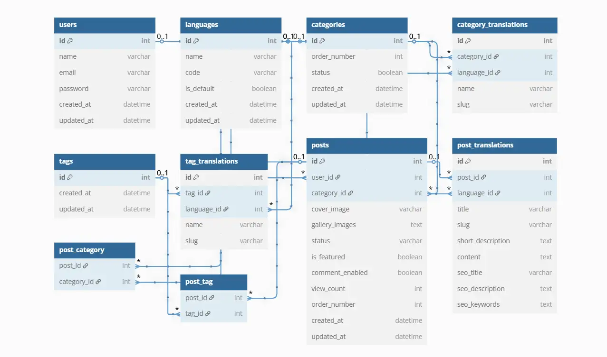

### Ana Sayfa
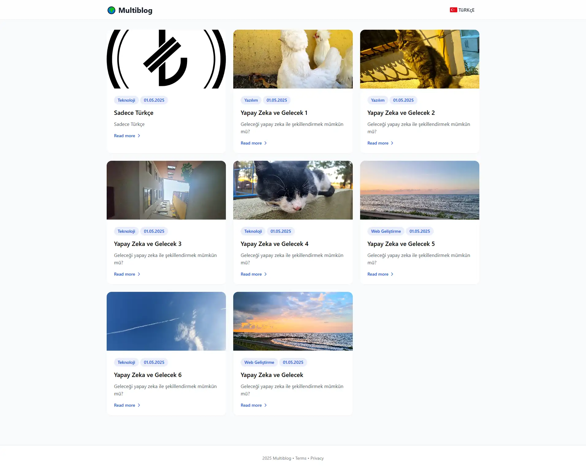

### Ana Sayfa En
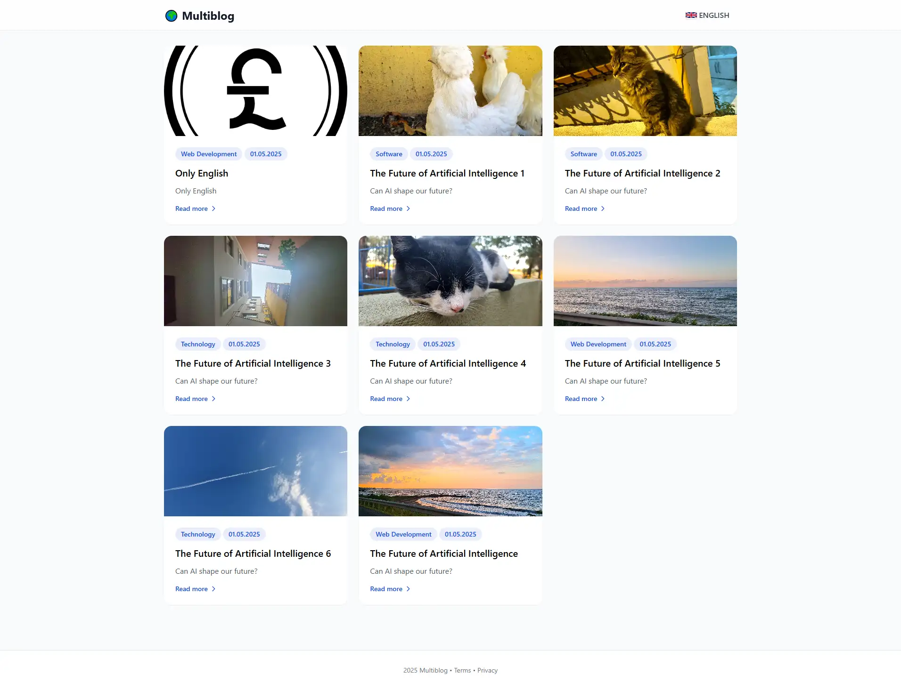

### Makale Sayfası
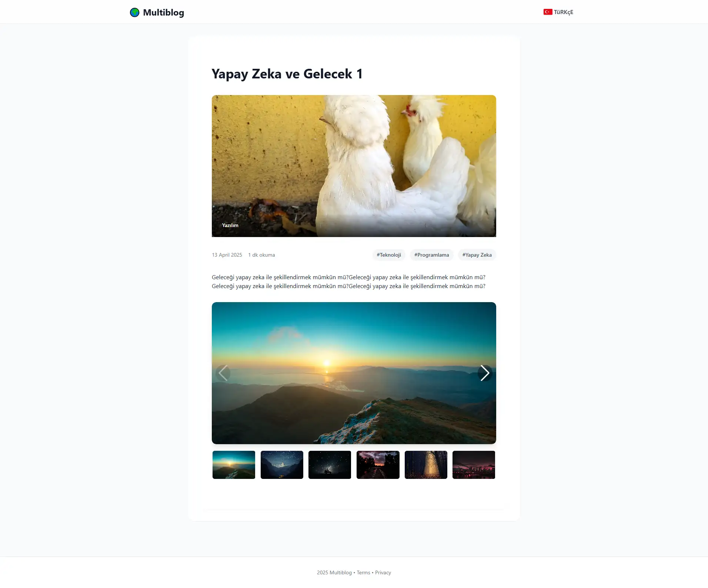

### Kategoriler Sayfası
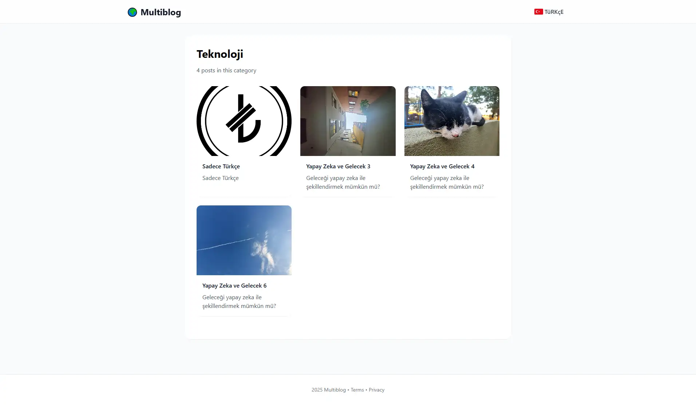

### Etiket Sayfası
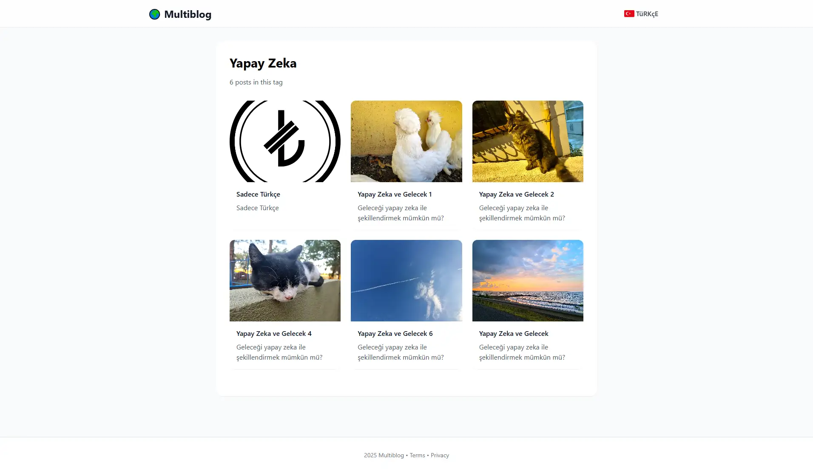

### Admin Paneli
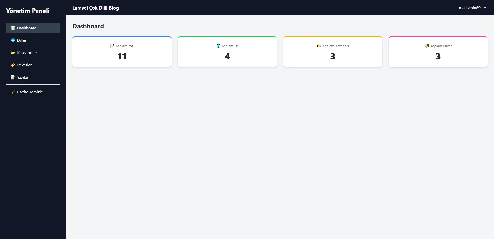

### Dil Sayfası
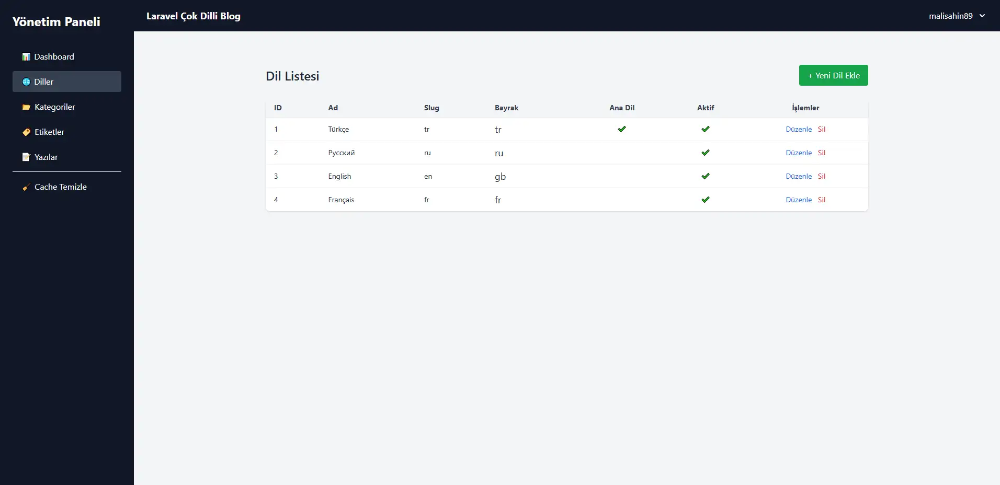

### Kategori Sayfası
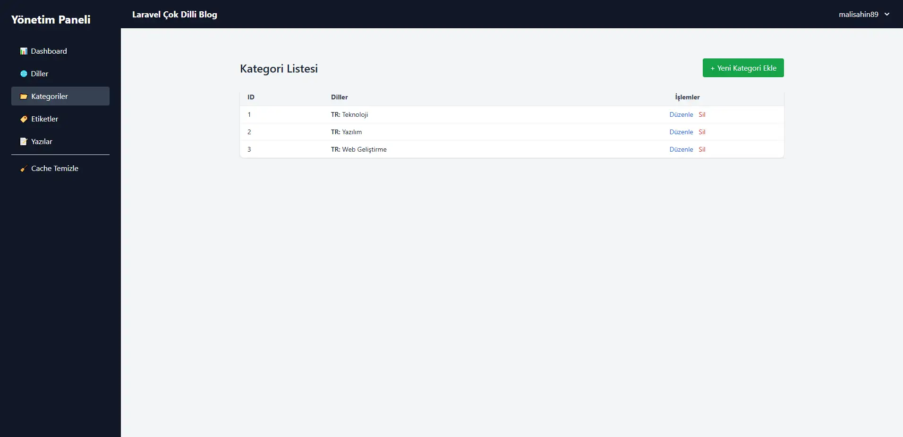

### Etiket Sayfası
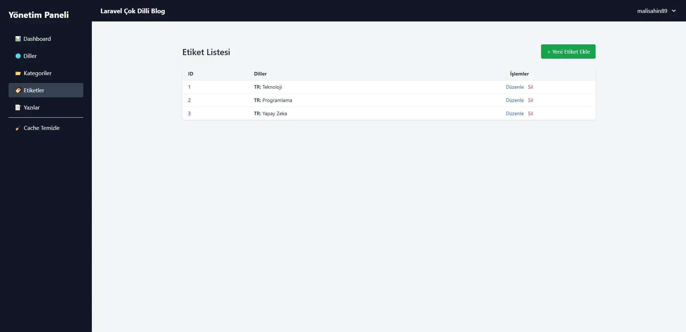

### Makale Sayfası
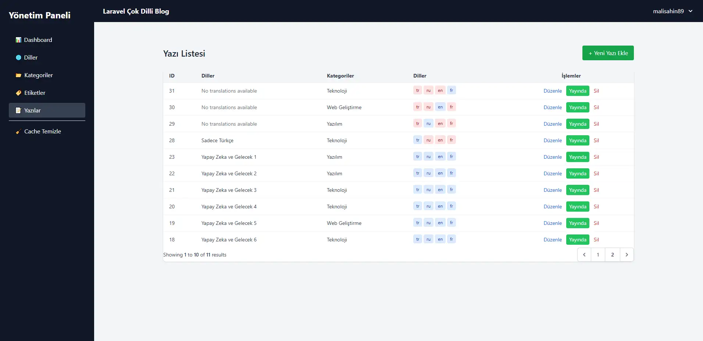

### Makale Edit Sayfası
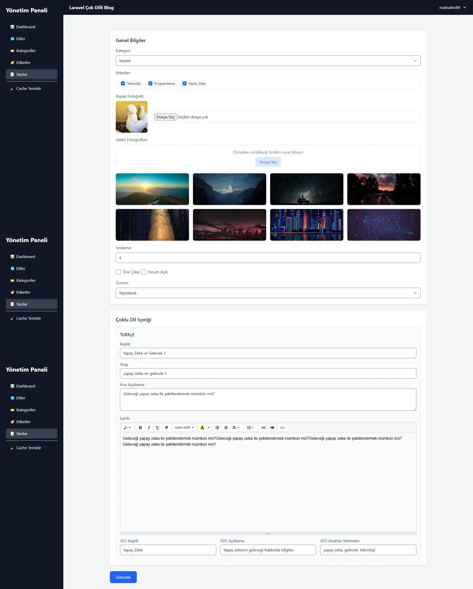

---

## 📄 Lisans

Bu proje açık kaynaklıdır, dilediğiniz gibi kullanabilir ve geliştirebilirsiniz.

---

## 💻 Geliştirici

Muhammet Ali ŞAHİN – [LinkedIn Profilim](https://www.linkedin.com/in/muhammetalisahin/)

